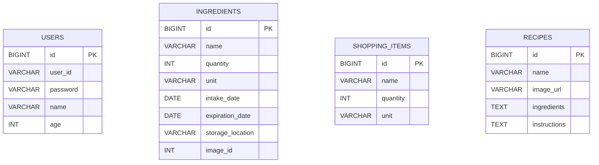

# Capstone Project

냉장고 속 재료를 자동으로 수집하고 레시피 추천으로 소비까지 연결하는 졸업 작품입니다. 안드로이드 앱과 Spring Boot 백엔드가 REST API로 통신하며, ML Kit 기반 바코드/영수증 인식으로 재료를 빠르게 입력할 수 있습니다.

## 프로젝트 목적
- 냉장고에 방치되던 재료의 유통기한과 보관 위치를 한눈에 확인
- 자동화된 입력 수단(바코드, OCR)으로 사용자의 입력 부담을 최소화
- 보유 재료 기반 레시피 추천으로 재료 소비를 촉진하고 식단 계획 지원

## 프로젝트 개요
- 개발 기간: 2024.09.02 ~ 2025.06.11 (중간/세미/최종 발표 진행)
- 팀 구성: 양재웅(팀장, 서버·DB), 강민경(UX/UI), 차대호(데이터 분석·API 연동)

## 기술 스택
- **모바일 앱**
  - Android (minSdk 24, targetSdk 34), Java, ViewBinding, Navigation Component
  - Volley, Retrofit2 & OkHttp, Glide, CameraX, ML Kit(Barcode/한글 OCR), Android-Image-Cropper
- **백엔드**
  - Spring Boot 3.3, Java 17, Gradle, Spring Web/Data JPA/Validation, Jackson JSR-310
  - MySQL 8.x, Hibernate, Global Exception Handler
- **인프라 & 협업 도구**
  - Docker Compose(MySQL), Android Studio, Slack, Zoom, Notion

## 실행 방법
- **사전 준비**
  - JDK 17 이상, Docker Desktop, Android Studio Koala 이상, Git
  - 포트 3306(MySQL)과 8080(Spring Boot)이 비어 있어야 합니다.

- **1. MySQL 컨테이너 실행**
  - 프로젝트 루트에 아래 내용을 가진 `docker-compose.mysql.yml` 파일을 생성합니다.
    ```yaml
    version: "3.8"
    services:
      mysql:
        image: mysql:8.0
        container_name: freshbox-mysql
        restart: unless-stopped
        environment:
          MYSQL_ROOT_PASSWORD: 1234
          MYSQL_DATABASE: FreshBox
          TZ: Asia/Seoul
        ports:
          - "3306:3306"
        command: --character-set-server=utf8mb4 --collation-server=utf8mb4_unicode_ci
    ```
  - 컨테이너 기동: `docker compose -f docker-compose.mysql.yml up -d`

- **2. Spring Boot 서버 실행**
  - `server/src/main/resources/application.yml`의 DB 접속 정보가 위 Compose 설정과 일치하는지 확인합니다.
  - 루트에서 `./gradlew :server:bootRun`
  - 서버가 기동되면 `http://localhost:8080/api/ingredients`로 헬스 체크 가능합니다.

- **3. 안드로이드 앱 실행**
  - Android Studio에서 `app` 모듈을 열고 Gradle sync 이후 에뮬레이터/디바이스를 선택합니다.
  - 에뮬레이터 사용 시 `ServerConfig.BASE_URL`(기본값 `http://10.0.2.2:8080`)을 그대로 사용합니다.
  - 실기기 테스트 시 PC의 IP로 `ServerConfig.BASE_URL`을 변경 후 빌드/실행합니다.

- **4. 외부 API**
  - 바코드: OpenFoodFacts(무료, 별도 키 불필요)
  - 레시피: 식품의약품안전처 공공데이터(`COOKRCP01`)를 XML로 조회하며, Spring 서버 커스텀 레시피 API와 병행합니다.

## ERD / API 명세

### ERD

- 현재 테이블 간 외래키는 구축하지 않았으며, 모든 데이터는 로그인 사용자 단일 세션을 기준으로 관리합니다. 향후 `user_id` FK 확장을 염두에 두고 서비스 레이어를 분리해 두었습니다.

### API 명세

#### 인증
| 기능 | 메소드 | 경로 | 요청 필드 | 응답 |
| --- | --- | --- | --- | --- |
| 회원가입 | POST | `/api/auth/register` | `userId`, `password`, `name`, `age` | `{"success":true,"userId":...,"userName":...,"age":...}` |
| 로그인 | POST | `/api/auth/login` | `userId`, `password` | `{"success":true,"userId":...,"userName":...,"age":...}` |

#### 재료
| 기능 | 메소드 | 경로 | 요청/파라미터 | 응답 |
| --- | --- | --- | --- | --- |
| 전체 조회 | GET | `/api/ingredients` | - | `[IngredientResponse]` |
| 등록 | POST | `/api/ingredients` | `name`, `quantity`, `unit`, `intakeDate(yyyy-MM-dd)`, `expirationDate`, `storageLocation`, `image` | 생성된 재료 |
| 수정 | PUT | `/api/ingredients/{id}` | 위와 동일(이름 제외) | 갱신된 재료 |
| ID 삭제 | DELETE | `/api/ingredients/{id}` | - | `204 No Content` |
| 이름 삭제 | DELETE | `/api/ingredients?name={name}` | `name` 쿼리 | `204 No Content` |
| 일괄 등록 | POST | `/api/ingredients/bulk` | `names[]=...`, `quantity`, `unit`, `expirationDate`, `storageLocation`, `image` (쿼리) | 등록된 재료 리스트 |

#### 장바구니
| 기능 | 메소드 | 경로 | 요청/파라미터 | 응답 |
| --- | --- | --- | --- | --- |
| 전체 조회 | GET | `/api/shopping-items` | - | `[ShoppingItemResponse]` |
| 등록 | POST | `/api/shopping-items` | `name`, `quantity`, `unit` | 생성된 품목 |
| 수정 | PUT | `/api/shopping-items/{id}` | `name`, `quantity`, `unit` | 갱신된 품목 |
| 삭제 | DELETE | `/api/shopping-items/{id}` | - | `204 No Content` |
| 냉장고로 이동 | POST | `/api/shopping-items/move-to-fridge` | `itemIds[]`, `storageLocation`, `intakeDate?`, `expirationDate?`, `unitOverride?`, `image?` | 이동 완료 후 재료 리스트 |

#### 레시피
| 기능 | 메소드 | 경로 | 요청/파라미터 | 응답 |
| --- | --- | --- | --- | --- |
| 검색/전체 조회 | GET | `/api/recipes?keyword={optional}` | `keyword`(콤마로 연결된 재료 목록) | `[RecipeResponse]` |
| 커스텀 레시피 등록 | POST | `/api/recipes` | `name`, `imageUrl`, `ingredients`, `instructions` | 생성된 레시피 |

- 모든 API는 실패 시 `GlobalExceptionHandler`를 통해 `{"success":false,"message":...}` 또는 필드 오류 맵을 반환합니다.
- 날짜는 ISO-8601 문자열(`yyyy-MM-dd`)을 사용하며, 시간대는 Asia/Seoul 기준입니다.

## 기능 흐름도
```mermaid
flowchart TD
    A[앱 실행] --> B[인트로/로그인]
    B -->|회원가입| C[회원가입 화면]
    B -->|로그인 성공| D[홈: 냉장고 현황]
    B -->|로그인 실패| B
    D --> E[재료 추가 허브]
    E --> F[바코드 스캔]
    E --> G[영수증 OCR]
    E --> H[직접 입력]
    F --> I[OpenFoodFacts API 조회]
    G --> J[텍스트 정제 & 품목 선택]
    D --> K[장바구니 화면]
    K --> L[move-to-fridge API]
    D --> M[레시피 추천]
    M --> N[/api/recipes 검색]
    D --> O[설정]
    O --> P[알림/권한 설정]
    D --> Q[유통기한 알림]
```
- 홈 화면은 냉장/냉동 재료를 분리해 보여주며 삭제 모드, 상세 보기, 장바구니 이동을 지원합니다.
- 레시피 화면은 서버 레시피 API와 공공데이터(XML) 결과를 병합해 표시합니다.

## 문제를 해결하기 위해 했던 고민
- **PHP에서 Spring Boot로 마이그레이션**: 기존 PHP 엔드포인트를 대체하면서도 앱 수정을 최소화하기 위해 DTO와 응답 구조를 PHP 서버와 유사하게 맞추고, `GlobalExceptionHandler`로 공통 응답 포맷을 정의했습니다.
- **자동 입력 정확도 향상**: 바코드·OCR 결과가 영문/한글 혼재 문자열인 경우가 많아 `IngredientData` 매핑 테이블을 만들어 카테고리당 키워드를 매칭하고 아이콘을 자동 지정하도록 구성했습니다.
- **중복 스캔 및 잘못된 입력 방지**: 바코드 스캔 결과를 `HashSet`으로 중복 체크하고, OCR 단계에서는 결제·할인 등 불필요한 키워드를 필터링해 실제 식품명만 추출하도록 전처리를 반복 조정했습니다.
- **재고 흐름 일관성**: 장바구니→냉장고 이동 시 기본 유통기한을 intakeDate+7일로 자동 보정하고, 이동 후 장바구니 데이터를 삭제하는 서비스를 별도로 구현해 재고 중복을 막았습니다.
- **권한 및 알림 정책 대응**: Android 13의 알림 권한과 카메라 권한 변화를 반영해 `SettingActivity`에서 토글별 권한 요청과 알림 스케줄링을 제공, 사용자 경험 저하 없이 보안 정책을 충족하도록 했습니다.
